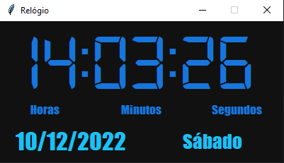

# Digital Clock Using Tkinter

> **REQUISITOS:**
* Criar um relógio utilizando a lib TKinter.

> **Bibliotecas utilizadas:**
* `import pyglet` - _Para a importação de fonte_
* `from tkinter import *`
* `from datetime import datetime`

 

    

